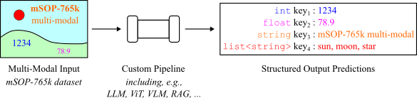

# mSOP-765k: A Benchmark For Multi-Modal Structured Output Predictions

## Abstract

This paper introduces mSOP-765k, a large-scale benchmark for the evaluation of multi-modal Structured Output Prediction (mSOP) pipelines. Besides novel evaluation metrics, the benchmark provides combined training and test datasets with over 765,000 images taken from real-world product advertisements. Each of these images contains product visualizations, textual information like product name or brand, and numerical data such as product weight, price, and discount. All images are annotated with the corresponding structured information in form of dictionaries containing key-value pairs. An initial baseline evaluation, including various LLMs and VLMs, as well as multi-modal RAG approaches, shows that the proposed benchmark provides a challenging problem which can not yet be solved completely by state-of-the-art mSOP methods. The benchmark and dataset are available under a creative-commons license:<br>
[https://huggingface.co/datasets/retail-product-promotion/mSOP-765k](https://huggingface.co/datasets/retail-product-promotion/mSOP-765k).<br>
<br>
<br>
The following image illustrates the multi-modal Structured Output Prediction task performed with the mSOP-765k dataset. The proposed benchmark measures the ability of a given processing pipeline to predict structured key-value pairs of textual, numerical, and list data.
<p align="center">
  
</p>


## Dataset Description
**Image Dataset:** This image dataset consists exclusively of image advertisements that have been cropped from leaflet pages. It has been published in context of a fine-grained image classification benchmark. In total, our provided image dataset contains 765,463 images divided into a train split of 728,892 images and a test split of 36,571 images. The training/test splits contain a minimum number of 10/3 images per label. In addition, our image dataset is available in two versions: one with images resized so that the longer edge measures 512 pixels, and another where the longer edge measures 256 pixels.<br>
<br>
**Structured Data:** In the mSOP-765k dataset, structured data refers to product and promotion data shown in the images. The product data comprises properties about the product(s) advertised. This data includes the information of brand, product category, GTINs, product weight, and different types. In contrast, the promotion data comprises the information on the advertised price, regular price, relative discount, and absolute discount.


## Data

- **Image Data:**

  - The images are cropped from scanned advertisement leaflets.
  - The image data is divided into `train` and `test` splits.
  - The image dataset is available in two versions: one with images resized so that the longer edge measures 512 pixels, and another where the longer edge measures 256 pixels.
  
  Refer to the folders [rpp-765k_512](https://huggingface.co/datasets/retail-product-promotion/mSOP-765k/tree/main/rpp-765k_512) and [rpp-765k_256](https://huggingface.co/datasets/retail-product-promotion/mSOP-765k/tree/main/rpp-765k_256).

- **Product and Promotion Data:**

  Product Data:
  - Product data contains the targets: **brand, product category, GTINs, product weight,** and **different types**.
  - If a promotion covers a variety of different types/flavors of the product, the GTIN of each type is recorded.

  Promotion Data:
  - Promotion data contains the targets: **price, regular price,** and **relative discount** or **absolute discount**.
 
  Refer to the files `train.parquet` and `test.parquet`.

- **Text Extraction Data:**

  The text extracted from the images by OCR with the PaddleOCR tool.

  Refer to the folder [text_extraction](https://huggingface.co/datasets/retail-product-promotion/mSOP-765k/tree/main/text_extraction).

## Usage

You can load and use the dataset with the Hugging Face `datasets` library.
```python
import os
import pandas as pd
import tarfile

from huggingface_hub import hf_hub_download, list_repo_files, login


repo_id     = "retail-product-promotion/mSOP-765k"
extract_dir = "your/path/to/extract/directory"
os.makedirs(extract_dir, exist_ok=True)

# Use your HF access token here
login(token="your/huggingface/token")

# 1. List all files in the repo
files = list_repo_files(repo_id=repo_id, repo_type="dataset")
# 2. Filter for .tar.gz files
tar_files = [f for f in files if f.endswith(".tar.gz")]
# 3. Download and extract each archive
for file in tar_files:
    print(f"Processing: {file}")
    archive_path = hf_hub_download(repo_id=repo_id, repo_type="dataset", filename=file)
    
    extract_path = os.path.join(extract_dir, os.path.dirname(file))
    os.makedirs(extract_path, exist_ok=True)

    with tarfile.open(archive_path, "r:gz") as tar:
        tar.extractall(path=extract_path)


df_train    = pd.read_parquet(hf_hub_download(repo_id=repo_id, repo_type="dataset", filename='train.parquet'), engine='pyarrow')
df_test     = pd.read_parquet(hf_hub_download(repo_id=repo_id, repo_type="dataset", filename='test.parquet'), engine='pyarrow')
```

## Experiments

To evaluate the dataset, we conducted a series of experiments using different approaches. 
The implementation code for the experiments can be found in the HuggingFace dataset repository [retail-product-promotion/mSOP-765k](https://huggingface.co/datasets/retail-product-promotion/mSOP-765k/tree/main/code).

The experiments fall into three main categories:

- **VLM Based Zero-Shot Approaches**<br>
These experiments utilize VLMs in a zero-shot setting. The code for these methods can be found in [code/vlm](https://huggingface.co/datasets/retail-product-promotion/mSOP-765k/tree/main/code/vlm).

- **Visual RAG Based Approach**<br>
The implementation details of the SOPs generated by a visual RAG based approach are located in [code/visual_rag](https://huggingface.co/datasets/retail-product-promotion/mSOP-765k/tree/main/code/visual_rag).

- **Fine-Tuning Based Approaches**<br>
We also fine-tune models on a random subset of the dataset. The fine-tuning scripts and corresponding data are provided under [code/fine_tuning](https://huggingface.co/datasets/retail-product-promotion/mSOP-765k/tree/main/code/fine_tuning).


## Previous Dataset

The raw image dataset is based on the Retail-786k dataset. This image dataset consists exclusively of image advertisements that have been cropped from leaflet pages.
More information and access to the dataset can be found in [Retail-786k](https://www.retail-786k.org/).
The paper of the Retail-786k dataset can be downloaded [here](https://arxiv.org/abs/2309.17164).


## Paper
Accepted at [Transactions on Machine Learning Research](https://jmlr.org/tmlr/) with J2C Certification.<br>
The paper can be downloaded [here](https://openreview.net/pdf?id=H7eYL4yFZS).

Citation:
```python
@article{
lamm2026msopk,
title={m{SOP}-765k: A Benchmark For Multi-Modal Structured Output Predictions},
author={Bianca Lamm and Janis Keuper},
journal={Transactions on Machine Learning Research},
issn={2835-8856},
year={2026},
url={https://openreview.net/forum?id=H7eYL4yFZS},
note={J2C Certification}
}
```


## License
This dataset is licensed under a [Creative Commons Attribution-NonCommercial-NoDerivatives 4.0 International](https://creativecommons.org/licenses/by-nc-nd/4.0/).
